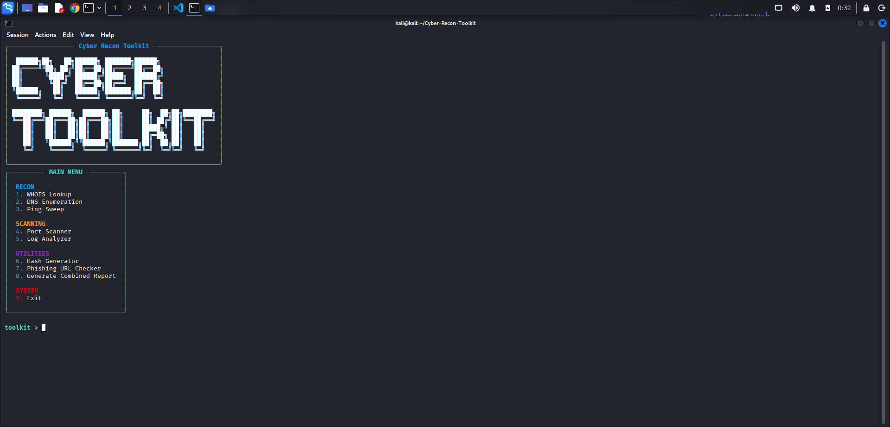
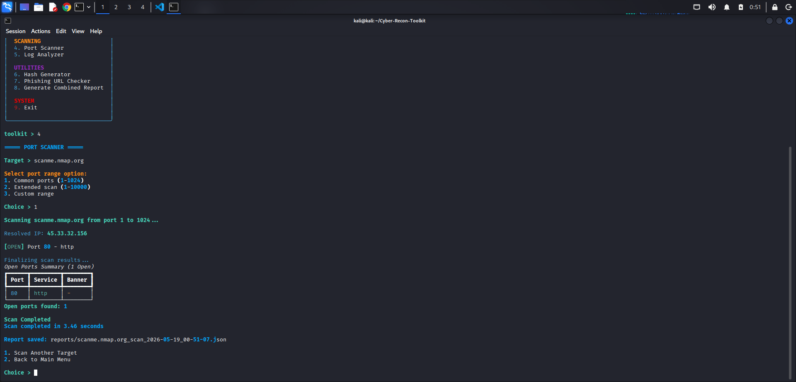
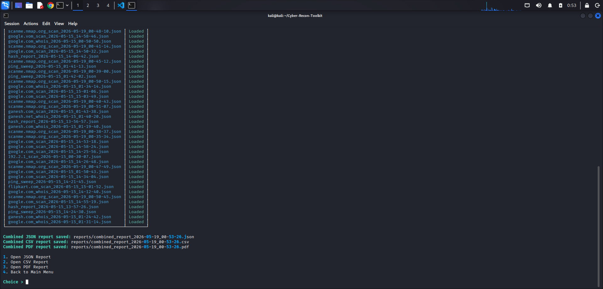
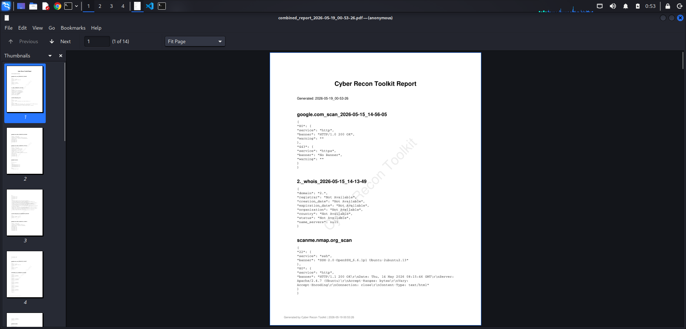

# Cyber Recon Toolkit

[](https://pypi.org/project/cyber-recon-toolkit/)
[](https://pypi.org/project/cyber-recon-toolkit/)
[](https://github.com/kvr585/Cyber-Recon-Toolkit)

📦 **Install directly from PyPI**

```bash
pip install cyber-recon-toolkit
cyber-recon
```

Cyber Recon Toolkit is a modular Python-based cybersecurity framework that provides reconnaissance, network analysis, automated security assessment, forensic utilities, and professional report generation through a unified command-line interface.

---

## Overview

This toolkit combines multiple reconnaissance, scanning, forensic, and reporting utilities into a single integrated Python platform. It is designed for practical cybersecurity workflows, clean CLI interaction, modular expansion, and evidence-oriented reporting.

---

## Features

### Reconnaissance Modules

- WHOIS Lookup
- DNS Enumeration
- Ping Sweep

### Scanning Modules

- TCP Port Scanner
- Log Analyzer

### Utility Modules

- Hash Generator
- Phishing URL Checker
- Combined Report Generator

### Security Assessment

- Automated Security Assessment
- Risk Classification (LOW / MEDIUM / HIGH)
- Executive Summary Generation
- Consolidated Security Reporting
- JSON Assessment Reports
- PDF Assessment Reports

---

## Reporting Features

- JSON report export
- CSV report export
- PDF report export
- Timestamped forensic reports
- PDF watermarking
- Consolidated evidence collection
- Cross-module report aggregation

---

## Project Structure

```text
Cyber-Recon-Toolkit/
├── cyber_recon_toolkit/
│   ├── modules/
│   │   ├── dns_enum.py
│   │   ├── hash_generator.py
│   │   ├── log_analyzer.py
│   │   ├── phishing_checker.py
│   │   ├── ping_sweep.py
│   │   ├── port_scanner.py
│   │   ├── report_generator.py
│   │   ├── security_assessment.py
│   │   └── whois_lookup.py
│   ├── __init__.py
│   ├── __main__.py
│   └── toolkit.py
├── README.md
├── pyproject.toml
├── requirements.txt
├── run.sh
├── screenshots/
├── reports/
└── logs/
```

---

## Requirements

- Python 3.10 or higher
- Linux-based environment recommended
- Tested on Kali Linux

---

## Installation

### Install from PyPI

The toolkit is published on PyPI and can be installed with a single command:

```bash
pip install cyber-recon-toolkit
cyber-recon
```

### Install from Source

Clone the repository for development:

```bash
git clone https://github.com/kvr585/Cyber-Recon-Toolkit.git
cd Cyber-Recon-Toolkit
./run.sh
```

The launcher automatically:

- Creates a virtual environment (`.venv`)
- Activates the environment
- Installs required dependencies
- Starts the toolkit

---

## Quick Start

After installation, launch the toolkit:

```bash
cyber-recon
```

Or if running from source:

```bash
./run.sh
```

---

## Running the Toolkit

Start the toolkit using:

```bash
./run.sh
```

Using the launcher ensures the virtual environment and dependencies are configured correctly before execution.

---

## Main Menu

```text
RECON
1. WHOIS Lookup
2. DNS Enumeration
3. Ping Sweep

SCANNING
4. Port Scanner
5. Log Analyzer

UTILITIES
6. Hash Generator
7. Phishing URL Checker
8. Generate Combined Report

ASSESSMENT
10. Automated Security Assessment

SYSTEM
9. Exit (Available from any menu)
```

---

## Module Details

### WHOIS Lookup

- Domain WHOIS lookup
- Registrar information
- Creation and expiration dates
- Domain status
- DNS nameservers
- JSON report generation

---

### DNS Enumeration

- A record lookup
- AAAA record lookup
- MX record lookup
- NS record lookup
- TXT record lookup
- CNAME discovery
- DNS summary output
- JSON report export

---

### Ping Sweep

- /24 subnet discovery
- Multithreaded ICMP scanning
- Live host detection
- Scan timing
- JSON reporting

---

### Port Scanner

- Multithreaded TCP port scanning
- Custom port range support
- Service detection
- Basic banner grabbing
- Progress tracking
- Resolved target IP display
- JSON reporting

---

### Log Analyzer

- Log file parsing
- Suspicious activity detection
- Error highlighting
- Security event inspection
- JSON export

---

### Hash Generator

- MD5 hashing
- SHA1 hashing
- SHA256 hashing
- SHA512 hashing
- Text hashing
- File hashing
- Hash verification
- File integrity checks
- JSON reporting

---

### Phishing URL Checker

- URL structure analysis
- Suspicious keyword detection
- IP-based URL detection
- URL length analysis
- HTTPS validation
- Domain extraction checks

---

### Automated Security Assessment

The Automated Security Assessment module performs multiple security checks against a target and generates a consolidated report.

Assessment workflow:

- WHOIS Analysis
- DNS Enumeration
- Port Scanning
- Phishing URL Analysis
- Risk Classification
- Executive Summary Generation
- JSON Report Export
- PDF Report Export

The module automatically combines findings from multiple components into a single assessment report for easier review and documentation.

---

### Combined Report Generator

- Aggregates module outputs into combined JSON
- Generates combined CSV reports
- Produces formatted PDF reports
- Adds forensic timestamps
- Includes PDF watermarking
- Allows direct report opening from toolkit

---

## Screenshots

### Main Menu



---

### Port Scanner



---

### Generated PDF Report





---

## Output and Reports

Generated reports are automatically saved inside the `reports/` directory.

Supported formats include:

- JSON
- CSV
- PDF

Generated reports may include:

- Scan results
- DNS findings
- WHOIS information
- Security events
- Forensic summaries
- Timestamps
- Watermarked PDF exports

---

## Disclaimer

This project is intended strictly for educational, academic, and authorized security testing purposes only.

Do not use this toolkit against systems, networks, or services without proper authorization.

The developer is not responsible for misuse or unauthorized activities performed using this toolkit.

---

## Author

**Veera Bhadhra Rao**

Cyber Security Student | Python Developer | Cybersecurity Enthusiast | Open Source Contributor

- GitHub: https://github.com/kvr585
- PyPI: https://pypi.org/project/cyber-recon-toolkit/